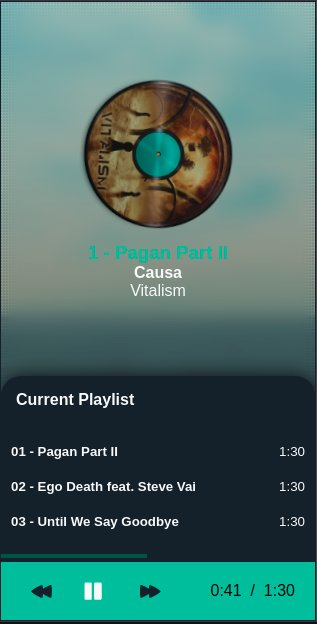
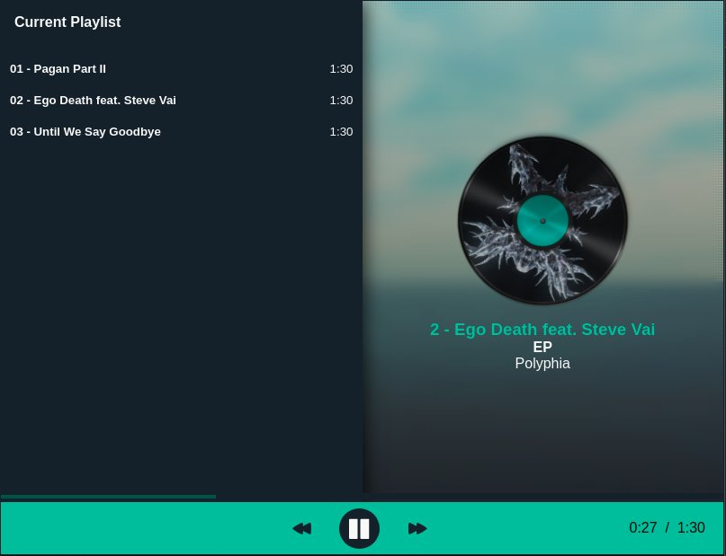
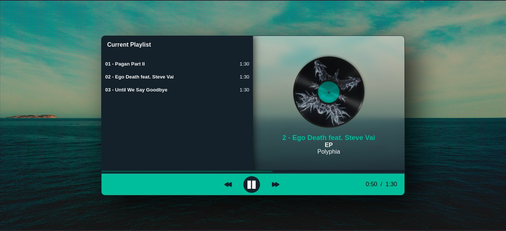

HTML Music Player

Simple Player de música construido de forma mais simple (em um dia de tédio). Projeto feito somete para praticar a programação diária e mater o hábite de programar todos os dias, mesmo que em um curto período do dia.

Visitar página: [HTML Music Player](https://devalvez.github.io/html-music-player/)

